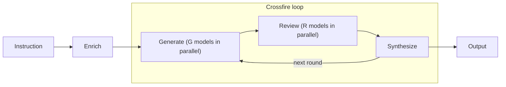

# Crossfire

Crossfire is a multi-agent adversarial refinement orchestrator, which means: it sends your prompt to multiple LLMs to generate text or code, reviews each generated artefact multiple times by different LLMs, and then merges the best pieces into one refined artefact.
That _generation → review → synthesis_ loop is repeated as many times as you want.
Crossfire implements a [multi-start evolutionary search with delayed selection](https://ianreppel.org/ralph-wiggum-as-a-degenerate-evolutionary-search/), or an improved [Ralph Wiggum](https://ghuntley.com/ralph/) method.

## Architecture



Each round runs _generation → review → synthesis_ sequentially; within generation and review, model calls run in parallel.
Rounds repeat until the configured limit or until reviewers find no material weaknesses (early stop).
Here, "material" means substantive issues like factual errors, logic flaws, or broken code, not style issues or nitpicks.
Each mode (research, code, edit, check, write) has its own review protocol: rubber duck debugging for code, precision review for editing, literary criticism for writing, and so on.

## How to use
### Prerequisites

- Python 3.12+
- [uv](https://docs.astral.sh/uv/) for dependency management

### Install

```bash
uv sync
```

### Set up API keys

```bash
export OPENROUTER_API_KEY="sk-or-..."
export TAVILY_API_KEY="tvly-..."      # only needed if search.enabled = true in crossfire.toml
```

### Run

```bash
uv run crossfire run \
  --mode research \
  --instruction "Compare error correction strategies for superconducting vs trapped-ion qubits" \
  --num-generators 2 \
  --num-reviewers-per-candidate 3 \
  --num-rounds 5
```

### CLI options

| Flag | Description | Default |
|:-----|:------------|:--------|
| `--mode` | One of `research`, `code`, `edit`, `check`, `write` | —-- |
| `--instruction` | Task instruction (mutually exclusive with `--instruction-file`) | —-- |
| `--instruction-file` | Read instruction from a file (mutually exclusive with `--instruction`) | —-- |
| `--context-file` | Supplementary reference material (see below) | none |
| `--num-generators` | Generators per round | 1 |
| `--num-reviewers-per-candidate` | Reviewers assigned to each candidate | 3 |
| `--num-rounds` | Number of rounds | 3 |
| `--enrich / --no-enrich` | Enrich instruction via a lightweight model before generation | true |
| `--early-stop / --no-early-stop` | Stop early when reviewers find no material weaknesses | true |
| `--early-stop-threshold` | Weakness threshold for early stopping | 1 |
| `--verbose`, `-v` | Show JSON log events | false |
| `--output` | Additional path to write the final output to | none |
| `--run-dir` | Archive directory for all run artifacts | `runs/<timestamp>` |
| `--config` | Path to `crossfire.toml` | auto-detected |
| `--dry-run` | Simulate without network calls | false |

#### Instruction vs context
The `--instruction` (or `--instruction-file`) is the **task**: what you want Crossfire to do.
The `--context-file` is **reference material**: source text, code to review, data to analyse.
They are separated because the pipeline treats them differently:
- The instruction is _never_ compressed, even when the full prompt exceeds the token budget.
  Context may be trimmed if the prompt doesn't fit the model's context window.
- The enricher rewrites the instruction into a richer brief but leaves the context untouched.
- Prompts place them in distinct sections so the LLMs know which is which.

```bash
# Short instruction + long reference document
uv run crossfire run \
  --mode research \
  --instruction "Summarize the key findings and identify methodological weaknesses" \
  --context-file paper.pdf
```

### Clean up
Remove all generated and cached files (runs, `.venv`, caches, bytecode):

```bash
uv run crossfire clean        # interactive
uv run crossfire clean --yes  # skip yes/no prompts
```

This deletes `runs/`, `.venv/`, `.ruff_cache/`, `.pytest_cache/`, `.mypy_cache/`, `__pycache__/` dirs, `*.pyc` files, and packaging artefacts (`dist/`, `build/`, `*.egg-info/`).
`clean` refuses to run unless it finds a `crossfire.toml` in the current directory, so a mistaken `cd` cannot nuke an unrelated project's `.venv`.
After cleaning, run `uv sync` to recreate the virtual environment.

## Modes

| Mode | Focus |
|---|---|
| `research` | Structured research with citations and verification of claims |
| `code` | Production code and associated tests with systematic rubber duck debugging review |
| `edit` | Precision editing with systematic anti-waffle and jargon elimination |
| `check` | Accuracy and logical validity checking |
| `write` | Creative writing with literary criticism and sceptical review |

### Model configuration
Each mode can override the global `[models.*]` defaults via `[modes.<mode>.*]` sections in `crossfire.toml`.
Only roles that differ need to be specified.
Any missing roles fall back to the global default.

Cross-group overlap is allowed: a model may both generate and review in the same round, as they do not share prompts or contexts.

## Configuration
Crossfire is configured via `crossfire.toml` at the project root.
The file defines four model groups (`enricher`, `generators`, `reviewers`, `synthesizer`), each with a list of model IDs, a context window, and maximum output tokens.
Per-mode overrides go in `[modes.<mode>.*]` sections.

See [`crossfire.toml`](crossfire.toml) for the full configuration with all 5 modes, per-model context window overrides, and detailed comments explaining the model selection rationale.

## Execution model
Each round has three sequential phases:

1. **Generation** — `num_generators` independent candidates produced in parallel
2. **Review** — each candidate reviewed by `num_reviewers_per_candidate` independent reviewers in parallel
3. **Synthesis** — all candidates and reviews merged into a single refined output

Rounds are strictly sequential, in which round _N+1_ uses round _N_'s synthesis as input.

### Prompt enrichment
When a `[models.enricher]` section is configured, Crossfire rewrites the raw user instruction into a richer, more structured brief before round 1 begins.
This adds constraints, clarifies ambiguities, and incorporates mode-specific rules so generators start from a stronger prompt.
This is particularly useful for short one-liners.
Disable with `--no-enrich`.

### Adaptive early stopping
After each round, Crossfire checks whether any reviewer found material weaknesses.
If all reviews report no weaknesses, the remaining rounds are skipped, as there is no value in further refinement.
Disable with `--no-early-stop`.

### Systematic review protocols
**Code mode** catches subtle issues that often slip through regular reviews:
- **Security vulnerabilities**: SQL injection, XSS, path traversal, hardcoded secrets
- **Logic errors**: Off-by-one errors, null pointer issues, edge case failures
- **Type safety**: Unsafe casts, missing type hints/declarations, implicit conversions
- **Error handling**: Unhandled exceptions, resource leaks, race conditions
- **Testing gaps**: Missing edge case tests, insufficient error path coverage
- **Performance issues**: Algorithmic complexity, unnecessary loops, memory leaks

**Edit mode** eliminates waffle and imprecision:
- **Precision & clarity**: Vague qualifiers, hedging language, weak verbs, unclear antecedents
- **Conciseness**: Redundant phrases, wordy constructions, unnecessary intensifiers, filler words
- **Business jargon & LLM waffling**: Corporate speak, buzzword clusters, throat-clearing, academic bloat
- **Structure & flow**: Buried main points, repetitive patterns, weak transitions, logic gaps

**Writer mode** provides literary criticism:
- **Story integrity**: Plot holes, character inconsistencies, pacing problems, unearned stakes
- **Voice & craft**: Authenticity, clichés, dialogue quality, show vs tell failures
- **Emotional resonance**: Genuine vs manipulative moments, forced sentiment, unearned emotion
- **Structure & clarity**: Confusing transitions, unnecessary scenes, weak endings
- **Originality & insight**: Derivative concepts, predictable developments, lack of depth

Each mode's review protocol is defined in `crossfire/core/prompts.py`.

## Logs and cost tracking
Structured events are emitted as JSON lines to stderr when `--verbose` / `-v` is passed.
Without it, stderr shows only the live progress display.
Timestamps use **local time**, because the output is meant for the operator at the terminal.

Key event types:
- `prompt_enriched`: the instruction was rewritten by the enricher model
- `compression_applied`: the token budget compression was applied
- `model_dropped`: a model was excluded because of token overflow or repeated failures
- `synthesis_decision`: which candidates were selected/discarded
- `early_stop`: the number of remaining rounds skipped because no weaknesses were found
- `round_failed`: a round could not complete
- `run_failed`: the entire run aborted
- `cost_summary`: per-model and total token/cost breakdown

You can filter these with standard tools:

```bash
uv run crossfire run ... -v 2>&1 | jq 'select(.event == "synthesis_decision")'
```

Every OpenRouter response's token usage and cost metadata is captured.
A `cost_summary` event is emitted at the end of each run with per-model and aggregate totals.

## Development

```bash
uv sync --all-extras
uv run pre-commit install      # set up git hooks (recommended)
uv run pytest                  # run tests
uv run pytest --cov            # run tests with coverage
uv run ruff check crossfire/   # lint
uv run mypy crossfire/         # type check
```

### Dry run

Use `--dry-run` to verify your changes without making API calls.
It produces deterministic synthetic outputs via SHA-256 hashing.

```bash
uv run crossfire run \
  --mode code \
  --instruction "Implement a binary search tree in Python" \
  --dry-run
```

### Run all checks locally

```bash
# Run the same checks as in CI
uv run pre-commit run --all-files && uv run pytest --cov

# Or use the convenience script
./scripts/check-all.sh
```

The pre-commit hooks automatically run `docformatter`, `ruff --fix`, `ruff format`, and `mypy` on every commit to ensure consistent code quality.

### Project structure

```
crossfire/
├── docs/                     # example artefacts
├── crossfire/
│   ├── core/
│   │   ├── orchestrator.py   # round loop, concurrency, failure handling
│   │   ├── domain.py         # domain primitives (Task, Candidate, etc.)
│   │   ├── prompts.py        # mode-aware prompt builders and output parsers
│   │   ├── config.py         # TOML loading with CLI override precedence
│   │   ├── logging.py        # structured JSON-line event logging
│   │   ├── tokens.py         # tiktoken-based estimation
│   │   ├── compression.py    # extractive compression and prompt fitting
│   │   ├── openrouter.py     # OpenRouter HTTP client with retry
│   │   ├── simulation.py     # deterministic fakes for dry-run mode
│   │   ├── progress.py       # progress reporting
│   │   ├── reviewers.py      # reviewer-to-candidate assignment
│   │   ├── search.py         # search integration with Tavily
│   │   ├── exclamations.py   # The Simpsons prefixes for error messages
│   │   └── archive.py        # disk archival
│   ├── ui/
│   │   └── tui.py            # Rich-based progress display
│   └── cli.py                # Click CLI entrypoint
├── tests/                    # comprehensive pytest suite
├── crossfire.toml            # default configuration
├── pyproject.toml
└── .pre-commit-config.yaml
```

## Limitations and future work

**Token budgets are per role group with optional per-model overrides.**
Set `context_window` to the model's actual limit; see `crossfire.toml` for override syntax.

**Token estimation is approximate.**
Counts use the `cl100k_base` tokenizer (via tiktoken) as a proxy for all providers.
Actual token counts may differ for non-OpenAI models.
A fixed safety margin of 50 tokens is added to every estimate to compensate.

**Output length defaults are role-specific.**
By default, `generators` and `reviewers` use `max_output_tokens = 4096`, while `synthesizer` uses `max_output_tokens = 32000`.
Configuration validation rejects any `max_output_tokens` that exceeds 80% of the effective context window.

**OpenRouter is the only LLM provider.**
Model IDs are sent to a single OpenRouter endpoint.
Direct API calls to Anthropic, Google, or OpenAI are not supported.

**Tavily is the only search provider.**
The `search.provider` config field is parsed but has no effect, because only Tavily is implemented.
Search results from the current round are injected into the next round's generator prompt; the requesting LLM does not see its own results in the same call.
A missing `TAVILY_API_KEY` fails at startup when `search.enabled = true`.
Transient HTTP or timeout errors at query time degrade gracefully to empty results rather than aborting the run.

**Compression is extractive, not generative.**
When prompts exceed the token budget, Crossfire compresses by dropping sections and sentences rather than summarizing.
Compression priority: 1) candidates, 2) reviews, and 3) context.
The task instruction is _never_ compressed.

**No streaming.**
Responses are received in full.
There is no incremental output during long generation or synthesis calls.

**No persistent state.**
Each run is self-contained.
There is no caching of intermediate results, so a crashed run must be restarted from scratch.

**Reasoning models may need special handling.**
Some models (o4-mini, o3, DeepSeek R1) reject `temperature` or expect `max_completion_tokens` instead of `max_tokens`.
Behaviour depends on how OpenRouter passes these through to the upstream provider.

**Review coverage can degrade silently.**
If reviewers fail, the round proceeds as long as each candidate has at least one review, even when `num_reviewers_per_candidate` is higher.
Failed reviews are logged as `model_dropped` events.

**Enricher input is not compressed.**
If a very large instruction is passed (e.g. a 200k-token file via `--instruction-file`), the enricher may exceed its context window with no fallback.

**Synthesis decision parsing expects single-line JSON.**
The synthesizer is instructed to emit the `crossfire_synthesis` JSON on one line.
Models that pretty-print across multiple lines will have their attribution metadata silently ignored.

### Ideas for future work

- **Resume** — restart interrupted runs from the last completed round (addresses the "no persistent state" limitation)
- **Skip archive on dry-run by default** — dry-runs are developer smoke tests; archiving them clutters `runs/` and produces fake artifacts that look real. Keep the current behaviour when `--run-dir` is explicitly passed (for inspecting the structure); skip otherwise.
- **Response caching** — cache identical prompts in dry-run mode to speed up development
- **Cost prediction** — estimate total run costs upfront from prompt sizes and model selection
- **Run comparison** — diff outputs, costs, and performance across runs
- **Custom prompt templates** — let users override default mode prompts
- **Incremental compression** — apply compression progressively during generation
- **Batch processing** — multiple instructions in a single run with shared context
- **Local web UI** — browser-based interface with live progress, output panel, and searchable run history
- **Library and containerization** — extract a reusable library and Docker image so Crossfire can run as a service (would also require UTC-based logging for cross-region deployments)
