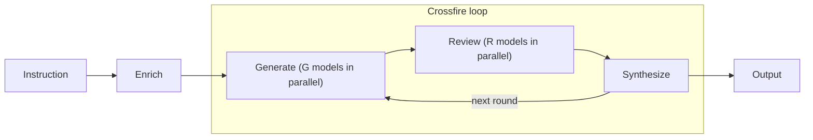

# Crossfire

Crossfire is a multi-agent adversarial refinement orchestrator: it sends your prompt to several LLMs, reviews each generated artefact with a different set of LLMs, and merges the strongest parts into one refined artefact.
That _generation → review → synthesis_ loop repeats as many times as you ask.
It is a [multi-start evolutionary search with delayed selection](https://ianreppel.org/ralph-wiggum-as-a-degenerate-evolutionary-search/), or an improved [Ralph Wiggum](https://ghuntley.com/ralph/) method.

## Architecture


```mermaid
flowchart LR
    Instruction --> Enrich
    Enrich --> Generate

    subgraph Crossfire loop
        Generate["Generate (G models in parallel)"]
        Review["Review (R models in parallel)"]
        Synthesize
        Generate --> Review --> Synthesize
        Synthesize -->|next round| Generate
    end

    Synthesize --> Output
```

Rounds run the three phases in sequence, and model calls run in parallel within generation and review.
They repeat until the configured limit or until reviewers find no material weaknesses (early stop).
"Material" here means factual errors, logic flaws, or broken code; style issues and nitpicks do not count.
Each mode (research, code, edit, check, write) carries its own review protocol: rubber duck debugging for code, precision review for editing, literary criticism for writing.

## How to use
### Prerequisites

- Python 3.12
- [uv](https://docs.astral.sh/uv/) for dependency management

### Install

```bash
uv python install 3.12         # transitive incompatibility in docformatter->untokenize
uv venv --python 3.12
uv sync
```

### Set up API keys

Crossfire talks to four gateways, switched with `--provider` or the `provider` key in `crossfire.toml`:

| Provider | Key | Notes |
|:---------|:----|:------|
| `opencode` (default) | `OPENCODE_API_KEY` | [OpenCode Zen](https://opencode.ai/docs/zen/) pay-as-you-go, and the home of the frontier models |
| `opencode-go` | `OPENCODE_API_KEY` | [OpenCode Go](https://opencode.ai/docs/go/) $10/mo subscription, open models only; the same key, since Go is a plan on the account |
| `openrouter` | `OPENROUTER_API_KEY` | [OpenRouter](https://openrouter.ai/) |
| `synthetic` | `SYNTHETIC_API_KEY` | [Synthetic](https://synthetic.new/), OpenAI-compatible; its `syn:*` aliases track whatever model it currently routes to |

```bash
export OPENCODE_API_KEY="..."          # default provider, and opencode-go
export OPENROUTER_API_KEY="sk-or-..."  # optional
export SYNTHETIC_API_KEY="syn-..."     # optional
export TAVILY_API_KEY="tvly-..."       # only needed if search.enabled = true in crossfire.toml
```

### Run

```bash
uv run crossfire run \
  --mode research \
  --instruction "Compare error correction strategies for superconducting vs trapped-ion qubits" \
  --num-generators 2 \
  --num-reviewers-per-candidate 3 \
  --num-rounds 5
```

### CLI options

| Flag | Description | Default |
|:-----|:------------|:--------|
| `--mode` | One of `research`, `code`, `edit`, `check`, `write` | required |
| `--instruction` | Task instruction (mutually exclusive with `--instruction-file`) | required |
| `--instruction-file` | Read instruction from a file (mutually exclusive with `--instruction`) | required |
| `--context-file` | Supplementary reference material (see below) | none |
| `--num-generators` | Generators per round | 1 |
| `--num-reviewers-per-candidate` | Reviewers assigned to each candidate | 3 |
| `--num-rounds` | Number of rounds | 3 |
| `--enrich / --no-enrich` | Enrich instruction via a lightweight model before generation | true |
| `--early-stop / --no-early-stop` | Stop early when reviewers find no material weaknesses | true |
| `--early-stop-threshold` | Weakness threshold for early stopping | 1 |
| `--verbose`, `-v` | Show JSON log events | false |
| `--output` | Additional path to write the final output to | none |
| `--run-dir` | Archive directory for all run artefacts | `runs/<timestamp>` |
| `--config` | Path to `crossfire.toml` | auto-detected |
| `--provider` | Gateway: `opencode`, `opencode-go`, `openrouter` | `crossfire.toml` value (`opencode`) |
| `--dry-run` | Simulate without network calls | false |

#### Instruction vs context
The `--instruction` (or `--instruction-file`) is the **task**: what you want Crossfire to do.
The `--context-file` is **reference material**: source text, code to review, data to analyse.
The pipeline treats them differently, which is why they are separate:
- The instruction is _never_ compressed, even when the full prompt exceeds the token budget.
  Context may be trimmed if the prompt doesn't fit the model's context window.
- The enricher rewrites the instruction into a richer brief but leaves the context untouched.
- Prompts place them in distinct sections so the LLMs know which is which.

```bash
# Short instruction + long reference document
uv run crossfire run \
  --mode research \
  --instruction "Summarize the key findings and identify methodological weaknesses" \
  --context-file paper.pdf
```

### Cost estimation
Cost estimation in `--dry-run` needs current model prices.
`crossfire prices` fetches them from OpenRouter (every model) and [models.dev](https://models.dev) (OpenCode Zen, OpenCode Go, and Synthetic), and stores them in `pricing.json`:

```bash
uv run crossfire prices
```

Prices are keyed by gateway (`opencode::glm-5.3`, `openrouter::anthropic/claude-fable-5.1`, and so on), so switching `--provider` picks the matching rates, including the cheaper Go subscription pricing.
Both catalogues are fetched wholesale, so you can edit `crossfire.toml` without re-fetching.

### Clean up
Remove all generated and cached files (runs, `.venv`, caches, bytecode):

```bash
uv run crossfire clean        # interactive
uv run crossfire clean --yes  # skip yes/no prompts
```

This deletes `runs/`, `.venv/`, `.ruff_cache/`, `.pytest_cache/`, `.mypy_cache/`, `__pycache__/` dirs, `*.pyc` files, and packaging artefacts (`dist/`, `build/`, `*.egg-info/`).
`clean` refuses to run unless it finds a `crossfire.toml` in the current directory, so a mistaken `cd` cannot nuke an unrelated project's `.venv`.
After cleaning, run `uv sync` to recreate the virtual environment.

## Modes

| Mode | Focus |
|---|---|
| `research` | Structured research with citations and verification of claims |
| `code` | Production code and associated tests with systematic rubber duck debugging review |
| `edit` | Precision editing with systematic anti-waffle and jargon elimination |
| `check` | Accuracy and logical validity checking |
| `write` | Creative writing with literary criticism and sceptical review |

### Model configuration
Each mode can override the global `[models.*]` defaults via `[modes.<mode>.*]` sections in `crossfire.toml`.
Only roles that differ need to be specified, and any missing role falls back to the global default.

Cross-group overlap is allowed: a model may both generate and review in the same round, because the two roles share neither prompt nor context.

## Configuration
Crossfire is configured via `crossfire.toml` at the project root.
The file defines four model groups (`enricher`, `generators`, `reviewers`, `synthesizer`), each with a list of model IDs, a context window, and maximum output tokens.
Per-mode overrides go in `[modes.<mode>.*]` sections.

**One neutral model list, many gateways.**
Model names in `[models.*]` are neutral slugs, OpenRouter-style, such as `anthropic/claude-fable-5.1`.
Each gateway maps them to its own wire IDs under `[providers.<name>.model_ids]`; a slug absent from a map passes through unchanged, which is why OpenRouter needs no map.
The bench therefore follows you across `--provider`, with OpenCode Go substituting its closest model for the slugs it does not carry.
Prefix a name with a gateway (`openrouter:openai/gpt-6-luna`) to pin that one model to a specific provider.

Wire protocols resolve per gateway: OpenRouter and Synthetic are OpenAI-compatible (chat), while OpenCode Zen and Go route by model family, sending Claude and Qwen to messages, GPT-6, GPT-5.6, Grok, and Muse to responses, and everything else to chat.
Temperature is sent only on the OpenAI-compatible chat protocol, since frontier models on the others reject it, and per-role defaults live under `[limits]`.
Reasoning effort applies on the responses protocol only.

See [`crossfire.toml`](crossfire.toml) for the full configuration, all five modes, and comments on the model-selection rationale.

## Execution model
Each round has three sequential phases:

1. **Generation**: `num_generators` independent candidates produced in parallel
2. **Review**: each candidate reviewed by `num_reviewers_per_candidate` independent reviewers in parallel
3. **Synthesis**: every candidate and review merged into one refined output

Rounds run in strict sequence: round _N+1_ takes round _N_'s synthesis as its input.

### Prompt enrichment
When a `[models.enricher]` section is configured, Crossfire rewrites the raw user instruction into a richer, more structured brief before round 1 begins.
This adds constraints, clarifies ambiguities, and incorporates mode-specific rules so generators start from a stronger prompt.
It is most useful for short one-liners.
Disable with `--no-enrich`.

### Adaptive early stopping
After each round, Crossfire checks whether any reviewer found material weaknesses.
If every review reports none, the remaining rounds are skipped, since further refinement has nothing to act on.
Disable with `--no-early-stop`.

### Generator refusal detection
Some models occasionally refuse to produce output, responding with meta-commentary like "the sources are insufficient" instead of answering the prompt.
Crossfire detects these refusals and attempts a replacement model from the generator pool.
If no replacement is available, the generator is dropped and the round fails gracefully.
The refusal is logged as a `model_dropped` event with reason `refusal`.

### Synthesis reuse
If a synthesis is itself a refusal or regression (detected by the same refusal patterns), Crossfire discards it and carries forward the previous round's synthesis.
This prevents a bad late round from overwriting good earlier output.
The event is logged as `synthesis_regression`.
If a synthesizer declines the request outright (a provider-level refusal) or returns nothing, Crossfire tries the next model in the synthesizer pool before failing the round, since a refusal is model-specific rather than a property of the task.

### Systematic review protocols
**Code mode** catches subtle issues that often slip through regular reviews:
- **Security vulnerabilities**: SQL injection, XSS, path traversal, hardcoded secrets
- **Logic errors**: Off-by-one errors, null pointer issues, edge case failures
- **Type safety**: Unsafe casts, missing type hints/declarations, implicit conversions
- **Error handling**: Unhandled exceptions, resource leaks, race conditions
- **Testing gaps**: Missing edge case tests, insufficient error path coverage
- **Performance issues**: Algorithmic complexity, unnecessary loops, memory leaks

**Edit mode** eliminates waffle and imprecision:
- **Precision & clarity**: Vague qualifiers, hedging language, weak verbs, unclear antecedents
- **Conciseness**: Redundant phrases, wordy constructions, unnecessary intensifiers, filler words
- **Business jargon & LLM waffling**: Corporate speak, buzzword clusters, throat-clearing, academic bloat
- **Structure & flow**: Buried main points, repetitive patterns, weak transitions, logic gaps

**Writer mode** provides literary criticism:
- **Story integrity**: Plot holes, character inconsistencies, pacing problems, unearned stakes
- **Voice & craft**: Authenticity, clichés, dialogue quality, show vs tell failures
- **Emotional resonance**: Genuine vs manipulative moments, forced sentiment, unearned emotion
- **Structure & clarity**: Confusing transitions, unnecessary scenes, weak endings
- **Originality & insight**: Derivative concepts, predictable developments, lack of depth

Each mode's review protocol is defined in `crossfire/core/prompts.py`.

## Logs and cost tracking
Structured events are emitted as JSON lines to stderr when `--verbose` / `-v` is passed.
Without it, stderr shows only the live progress display.
Timestamps use **local time**, because the output is meant for the operator at the terminal.

Key event types:
- `prompt_enriched`: the instruction was rewritten by the enricher model
- `compression_applied`: the token budget compression was applied
- `model_dropped`: a model was excluded because of token overflow or repeated failures
- `synthesis_decision`: which candidates were selected/discarded
- `early_stop`: the number of remaining rounds skipped because no weaknesses were found
- `round_failed`: a round could not complete
- `run_failed`: the entire run aborted
- `cost_summary`: per-model and total token/cost breakdown

You can filter these with standard tools:

```bash
uv run crossfire run ... -v 2>&1 | jq 'select(.event == "synthesis_decision")'
```

Every response's token usage, including cache-read and cache-write tokens, is captured.
OpenRouter reports cost directly; OpenCode Zen, Go, and Synthetic do not, so their cost is derived from `pricing.json` after a `crossfire prices` run.
A `cost_summary` event closes each run with per-model and aggregate totals.
When a reasoning model burns its output budget on thinking and returns nothing, Crossfire treats it as a truncation and swaps in a replacement model instead of retrying the identical call.

## Development

```bash
uv python install 3.12         # transitive incompatibility in docformatter->untokenize
uv venv --python 3.12
uv sync
uv run pre-commit install      # set up git hooks (recommended)
uv run pytest                  # run tests
uv run pytest --cov            # run tests with coverage
uv run ruff check crossfire/   # lint
uv run mypy crossfire/         # type check
```

### Dry run

Use `--dry-run` to verify your changes without making API calls.
It produces deterministic synthetic outputs via SHA-256 hashing.
If `pricing.json` is present (from a `crossfire prices` run), the summary table includes an upper-bound cost estimate.

```bash
uv run crossfire run \
  --mode code \
  --instruction "Implement a binary search tree in Python" \
  --dry-run
```

### Run all checks locally

```bash
# Run the same checks as in CI
uv run pre-commit run --all-files && uv run pytest --cov

# Or use the convenience script
./scripts/check-all.sh
```

The pre-commit hooks run `docformatter`, `ruff --fix`, `ruff format`, and `mypy` on every commit, which keeps code quality consistent.

### Project structure

```
crossfire/
├── docs/                     # example artefacts
├── crossfire/
│   ├── core/
│   │   ├── orchestrator.py   # round loop, concurrency, failure handling
│   │   ├── domain.py         # domain primitives (Task, Candidate, etc.)
│   │   ├── prompts.py        # mode-aware prompt builders and output parsers
│   │   ├── config.py         # TOML loading with CLI override precedence
│   │   ├── logging.py        # structured JSON-line event logging
│   │   ├── tokens.py         # tiktoken-based estimation
│   │   ├── compression.py    # extractive compression and prompt fitting
│   │   ├── providers.py      # multi-gateway HTTP client and wire-protocol adapters
│   │   ├── simulation.py     # deterministic fakes for dry-run mode
│   │   ├── progress.py       # progress reporting
│   │   ├── reviewers.py      # reviewer-to-candidate assignment
│   │   ├── search.py         # search integration with Tavily
│   │   ├── pricing.py        # multi-provider pricing cache and cost estimation
│   │   ├── exclamations.py   # The Simpsons prefixes for error messages
│   │   └── archive.py        # disk archival
│   ├── ui/
│   │   └── tui.py            # Rich-based progress display
│   └── cli.py                # Click CLI entrypoint
├── tests/                    # pytest test suite
├── scripts/                  # convenience scripts (check-all.sh)
├── crossfire.toml            # default configuration
├── pyproject.toml
└── .pre-commit-config.yaml
```

## Limitations and improvements

**Token estimation is approximate.**
Counts use `cl100k_base` (via tiktoken) as a proxy across providers, so actual counts differ for non-OpenAI models.

**Gateway coverage.**
OpenCode Zen, OpenCode Go, and OpenRouter are supported.
Google Gemini uses a wire protocol Crossfire does not implement yet, so Gemini models are rejected with a clear error.
OpenCode Go carries open models only, so frontier slugs are mapped to their closest Go equivalent to keep the bench usable.
A model pinned to another gateway with a `provider:` prefix (e.g. `openrouter:perplexity/sonar-pro`) is dropped from the active gateway's groups, so Perplexity's grounded research runs on OpenRouter and never interferes with an OpenCode run.

**OpenCode free-tier models are not callable.**
Models such as Big Pickle are gated to the OpenCode client itself, and Zen returns `403 FreeTierError` to any other caller.
Use a paid Zen model or the Go subscription instead; the config never relies on free-tier models.

**Tavily is the only search provider.**
A missing `TAVILY_API_KEY` fails at startup when `search.enabled = true`.
Transient errors degrade to empty results rather than aborting the run.

**Compression is extractive.**
When a prompt exceeds the token budget, Crossfire drops sections and sentences rather than summarizing them.
The task instruction is _never_ compressed.

**Cost estimates are approximate.**
The dry-run estimate follows the same model selection the run will make, namely the first N generators, the reviewer window, and the rotating synthesizer, and applies fixed output-token defaults (~5,000 per generator and synthesizer call, ~2,000 per reviewer).
What remains uncertain is the token counts, not the prices: it cannot predict early stopping or actual output lengths, so it overestimates runs that stop early.
An explicit word or page count in the instruction overrides the default, though the regex can also match a count that describes the input rather than the wanted output.

**No streaming.**
Responses arrive in full.

**No persistent state.**
Each run is self-contained, so a crash means starting over.

### Ideas for improvements

- Resume: restart an interrupted run from the last completed round
- Local UI: a browser interface with live progress, an output panel, and searchable run history
- Library and containerization: extract a reusable library and Docker image so Crossfire can run as a service (switch logs to UTC)
